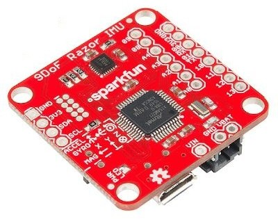
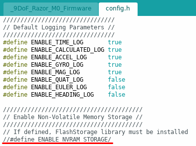
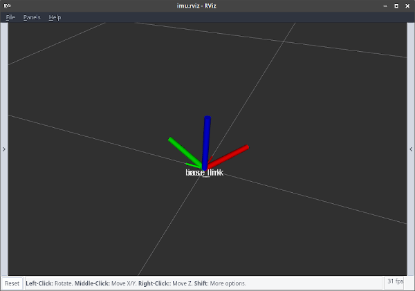
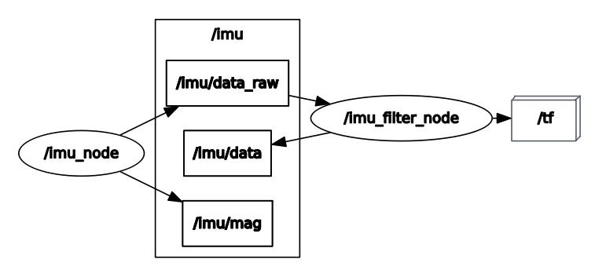

# razor_imu

Sparkfun 9DoF Razor IMU M0 node for ROS.



## Arduino Environment

1. Following [\[9DoF Razor IMU M0 Hookup Guide\]](https://learn.sparkfun.com/tutorials/9dof-razor-imu-m0-hookup-guide). Start from step: "Installing the 9DoF Razor Arduino Core" to the step: "Select the Board and Serial Port".

2. Download [\[MPU-9250 DMP library\]](https://github.com/sparkfun/SparkFun_MPU-9250-DMP_Arduino_Library) to your Arduino lib path (default to ~/Arduino/libraries/)

> Note:
>
> My current specs
>
> - Ubuntu 16.04 (x86 64 bits)
> - Arduino 1.8.11
> - Arduino SAMD Boards 1.6.19
> - SparkFun SAMD Boards 1.6.1
>
> You might get following error message when using different versions.
>> java.io.IOException: Cannot run program "{runtime.tools.bossac-1.7.0.path}/bossac.exe": CreateProcess error=2 ...

## Method 1: razor-imu-9dof

[\[razor_imu_9dof\]](http://wiki.ros.org/razor_imu_9dof)

```bash
sudo apt-get install ros-<distro>-razor-imu-9dof
sudo apt-get install python-visual
```

> Note: Calibrating the magnetometer is necessary.

## Method 2: imu-tools

The magnetometer can be easibly affected by current, magnet or any magnetizable material. It leads to the orientation estimation not correct (yaw). So, it is recommended to use the [\[imu-tools\]](http://wiki.ros.org/imu_tools) package to fuse only the angular velocities and accelerations into the orientation by yourself.

```bash
sudo apt install ros-<distro>-imu-tools
```

### Firmware

1. Use Arduino IDE to open the firmware [\[9DoF_Razor_M0_Firmware\]](https://github.com/sparkfun/9DOF_Razor_IMU/tree/master/Firmware/_9DoF_Razor_M0_Firmware)
2. Disable NVRAM_STORAGE in config.h as following picture
3. Upload



### ROS

```bash
catkin_make
roslaunch razor_imu imu.launch
```




